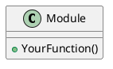

# 🛠️ C++ Project Generator (AI-Ready, Cross-Platform, Modular, Industry-Standard)

---

## How to use this generator
- For each section, review the example and expected format.
- Provide your input in the space indicated.
- Type **"continue"** to move to the next section after entering your input.
- The generator adapts based on your choices (e.g., build system, test framework).
- At each step, your feedback is requested before finalizing.
- Replace placeholders like `<module>` or `your_project_name` with your actual names.

---

## 1️⃣ Project Overview
**Describe your project in 1-2 sentences.**
*Example:*
> "A cross-platform C++ library for high-performance JSON parsing, with unit tests and CI integration."

*Type your project overview, then say "continue" to proceed.*

---

## 2️⃣ Essential Project Details
**Fill in each point below. Example answers are provided.**
- **Main goal:** (e.g., "C++ library for JSON parsing")
- **Target platforms:** (Windows, Linux, macOS, embedded, etc.)
- **Build system:** (CMake [recommended], Meson, Bazel, Make, etc.)
- **Compiler(s):** (GCC, Clang, MSVC, etc.)
- **Dependencies:** (e.g., Boost, fmt, GoogleTest)
- **Testing framework:** (GoogleTest [recommended], Catch2, doctest)
- **Documentation:** (Doxygen [recommended], Sphinx, Markdown)
- **CI/CD integration:** (GitHub Actions, GitLab CI, Azure Pipelines)
- **License & author:** (e.g., MIT, Author: Jane Doe)

*Fill in your project details above, then say "continue" to proceed.*

---

## 3️⃣ Project Structure Preview
**Based on your inputs, here is a suggested project structure:**
```
your_project_name/
├── CMakeLists.txt
├── src/
│   ├── main.cpp
│   ├── [module].cpp
│   └── [module].hpp
├── include/
│   └── [module]/
│       └── [module].hpp
├── tests/
│   ├── CMakeLists.txt
│   └── test_[module].cpp
├── docs/
│   ├── design.puml
│   └── index.md
├── .clang-format
├── .clang-tidy
├── .editorconfig
├── .gitignore
├── .pre-commit-config.yaml
├── LICENSE
├── CONTRIBUTING.md
└── README.md
```
*Suggest any changes (add/remove folders, rename files, or include additional modules). Type your feedback, then say "continue" to proceed.*

---

## 4️⃣ Recommended Setup
**Review and confirm or modify the recommended setup. Example:**
- **Build System:** CMake (with cross-platform presets)
- **C++ Standard:** C++20 (or latest stable)
- **Code Style:** clang-format, clang-tidy, .editorconfig, MISRA (if safety-critical)
- **Testing:** GoogleTest, 90%+ coverage (enforced in CI)
- **Documentation:** Doxygen with Markdown support
- **Pre-commit Hooks:** Yes (lint, format, test)
- **CI/CD:** GitHub Actions (build, test, lint, doc, coverage badge)
- **PlantUML:** For architecture and code flow diagrams
- **Static Analysis:** cppcheck (optional)
- **Sanitizers:** AddressSanitizer, UBSan (optional in CI)

*Confirm or edit your setup, then say "continue" to proceed.*

---

## 5️⃣ Build System Configuration
**Example: CMakeLists.txt (root)**
```cmake
cmake_minimum_required(VERSION 3.20)
project(your_project_name VERSION 0.1.0 LANGUAGES CXX)

set(CMAKE_CXX_STANDARD 20)
set(CMAKE_CXX_STANDARD_REQUIRED ON)

add_subdirectory(src)
add_subdirectory(tests)
```
*If you selected a different build system, adapt this section accordingly.*

*Confirm or adapt the build system configuration for your needs, then say "continue" to proceed.*

---

## 6️⃣ Coding Standards & Linting
**Example: .clang-format**
```yaml
BasedOnStyle: Google
IndentWidth: 4
ColumnLimit: 100
```
**Example: .clang-tidy**
```yaml
Checks: 'modernize-*,performance-*,readability-*'
WarningsAsErrors: '*'
```
**Example: .editorconfig**
```
root = true

[*]
indent_style = space
indent_size = 4
end_of_line = lf
charset = utf-8
trim_trailing_whitespace = true
insert_final_newline = true
```
**Pre-commit hooks:**
- Use [pre-commit](https://pre-commit.com/) with a `.pre-commit-config.yaml` for linting, formatting, and running tests before commit.

*Confirm or provide your preferred code style, linting rules, and pre-commit setup, then say "continue" to proceed.*

---

## 7️⃣ Unit Testing Setup
**Example: GoogleTest Integration**
- Add GoogleTest as a submodule or via CMake's FetchContent.
- Example test file: `tests/test_[module].cpp`
```cpp
#include <gtest/gtest.h>
#include "[module]/[module].hpp"

TEST([Module]Test, ExampleTest) {
    EXPECT_EQ(YourFunction(), expected_value);
}
```
- **Test coverage:** Use `gcov`/`lcov` or `codecov` for coverage.
- **CI enforcement:** Fail CI if coverage drops below threshold.

*Confirm or specify your testing framework, example test, and coverage requirements, then say "continue" to proceed.*

---

## 8️⃣ Documentation & Diagrams
**Example: Doxygen + PlantUML**
- Doxygen config with Markdown and PlantUML integration.
- Example PlantUML diagram (`docs/design.puml`):

- Reference diagrams in Markdown docs (e.g., `docs/index.md`).
- **Tip:** Add at least one PlantUML diagram for architecture, interfaces, or code flow.
- **Doxygen config:**
  - Enable Markdown support: `MARKDOWN_SUPPORT = YES`
  - PlantUML integration: `USE_PLANTUML = YES`

*Confirm or specify your documentation and diagramming preferences, then say "continue" to proceed.*

---

## 9️⃣ CI/CD Workflow
**Example: GitHub Actions**
```yaml
name: C++ CI
on: [push, pull_request]
jobs:
  build-test:
    runs-on: ubuntu-latest
    steps:
      - uses: actions/checkout@v3
      - name: Install dependencies
        run: sudo apt-get update && sudo apt-get install -y cmake g++ doxygen graphviz lcov cppcheck
      - name: Configure
        run: cmake -S . -B build
      - name: Build
        run: cmake --build build
      - name: Run tests
        run: ctest --test-dir build
      - name: Coverage
        run: |
          lcov --capture --directory build --output-file coverage.info
          lcov --remove coverage.info '/usr/*' --output-file coverage.info
          lcov --list coverage.info
      - name: Lint
        run: clang-tidy src/*.cpp
      - name: Static Analysis
        run: cppcheck src/
      - name: Generate docs
        run: doxygen Doxyfile
      - name: Upload coverage to Codecov
        uses: codecov/codecov-action@v3
```
- **Tip:** Add a badge for build and coverage status in `README.md`.
- **Artifacts:** Optionally upload test reports, coverage, and docs.

*Confirm or adapt the CI/CD workflow for your needs, then say "continue" to proceed.*

---

## 🔟 Final Checklist
- [ ] Project overview and details filled
- [ ] Setup confirmed
- [ ] Structure reviewed and finalized
- [ ] Build system configured
- [ ] Coding standards, .editorconfig, and pre-commit hooks set
- [ ] Unit tests and coverage ready
- [ ] Documentation and PlantUML diagrams in place
- [ ] CI/CD workflow ready
- [ ] Code is cross-platform and reusable
- [ ] Contribution guidelines and code of conduct in place
- [ ] License compatibility reviewed

*Review the checklist and type "done" when finished.*

---

## ✅ Next Steps
- Review all generated files and configurations.
- Run initial build and tests.
- Update documentation and diagrams as your project evolves.
- Use this generator for future C++ projects to ensure consistency and quality.
