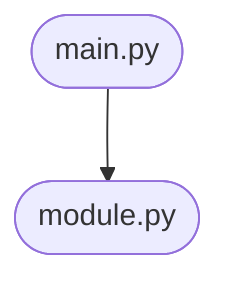

# 🐍 **Python Project Generation Template (Modern, Modular, Production-Ready, AI-Ready)**

---

## How to use this template

- For each section, review the example and the expected format.
- Provide your input in the space indicated.
- Type **"continue"** to move to the next section after entering your input.
- The template adapts based on your choices (e.g., web, CLI, data, ML, etc.).
- At each step, your feedback is requested before finalizing.
- Replace placeholders like `<module>` or `your_project_name` with your actual names.

---

# 1️⃣ Project Overview

**Describe your project in 1-2 sentences.**  
*Example:*  
> "A Python CLI tool to monitor a folder and back up new files to cloud storage, with tests and docs."

**Your turn (example answer below):**  
> "A REST API for managing a personal book collection, with OpenAPI docs and CI."

*Type your project overview, then say "continue" to proceed.*

---

# 2️⃣ Essential Project Details

**Fill in each point below. Example answers are provided.**

- **Main goal:** (e.g., "REST API for books")
- **Target platforms:** (Windows, Linux, macOS, cloud, etc.)
- **Python version:** (e.g., 3.11+)
- **Dependencies:** (e.g., FastAPI, SQLAlchemy, requests, pandas)
- **Testing framework:** (pytest [recommended], unittest, etc.)
- **Linting & type checking:** (ruff [recommended], mypy, flake8)
- **Documentation:** (MkDocs [recommended], Sphinx, Markdown)
- **CI/CD integration:** (GitHub Actions, GitLab CI, Azure Pipelines)
- **License & author:** (e.g., MIT, Author: Jane Doe)

**Your turn (example answer below):**  
> Main goal: REST API for books  
> Platforms: Windows, Linux  
> Python: 3.11+  
> Dependencies: FastAPI, SQLAlchemy, pytest  
> Linting: ruff  
> Docs: MkDocs  
> CI/CD: GitHub Actions  
> License: MIT, Author: Alex Smith

*Fill in your project details above, then say "continue" to proceed.*

---

# 3️⃣ Project Structure Preview

**Based on your inputs, here is a suggested project structure:**
```
your_project_name/
├── src/
│   └── your_project_name/
│       ├── __init__.py
│       ├── main.py
│       └── [module].py
├── tests/
│   └── test_[module].py
├── docs/
│   ├── index.md
│   └── diagrams/
│       └── architecture.mmd
├── .gitignore
├── pyproject.toml
├── mkdocs.yml
├── .editorconfig
├── .pre-commit-config.yaml
├── LICENSE
├── CONTRIBUTING.md
└── README.md
```
**Please review this structure. Suggest any changes (e.g., add/remove folders, rename files, or include additional modules).**  
*Type your feedback, then say "continue" to proceed.*

---

# 4️⃣ Recommended Setup

**Review and confirm or modify the recommended setup. Example:**

- **Python Version:** 3.11+
- **Dependency Management:** uv (with pyproject.toml)
- **Code Style:** ruff, .editorconfig, PEP 8
- **Testing:** pytest, 90%+ coverage (enforced in CI)
- **Documentation:** MkDocs with Mermaid diagrams
- **Pre-commit Hooks:** Yes (lint, format, test)
- **CI/CD:** GitHub Actions (build, test, lint, doc, coverage badge)
- **Static Analysis:** mypy (optional)
- **Env Config:** .env.example, config.yaml

**Your turn (edit as needed):**  
*Confirm or edit your setup, then say "continue" to proceed.*

---

# 5️⃣ Build & Configuration

**Example: pyproject.toml (snippet)**
```toml
[project]
name = "your_project_name"
version = "0.1.0"
description = "Short project description."
requires-python = ">=3.11"

[tool.uv]
# uv-specific settings

[tool.ruff]
# ruff linting config
```
*If you use a different tool (e.g., poetry, pip), adapt this section accordingly.*

**Your turn:**  
*Confirm or adapt the build/configuration for your needs, then say "continue" to proceed.*

---

# 6️⃣ Coding Standards & Linting

**Example: ruff config in pyproject.toml**
```toml
[tool.ruff]
line-length = 100
select = ["E", "F", "I", "N", "UP", "B"]
```
**Example: .editorconfig**
```
root = true

[*]
indent_style = space
indent_size = 4
end_of_line = lf
charset = utf-8
trim_trailing_whitespace = true
insert_final_newline = true
```
**Pre-commit hooks:**  
- Use [pre-commit](https://pre-commit.com/) with a `.pre-commit-config.yaml` for linting, formatting, and running tests before commit.

**Your turn:**  
*Confirm or provide your preferred code style, linting rules, and pre-commit setup, then say "continue" to proceed.*

---

# 7️⃣ Unit Testing Setup

**Example: pytest Integration**
- Place tests in `tests/`.
- Example test file: `tests/test_[module].py`
```python
import pytest
from your_project_name import [module]

def test_example():
    assert [module].your_function() == expected_value
```
- **Test coverage:** Use `pytest-cov` or `coverage.py`.
- **CI enforcement:** Fail CI if coverage drops below threshold.

**Your turn:**  
*Confirm or specify your testing framework, example test, and coverage requirements, then say "continue" to proceed.*

---

# 8️⃣ Documentation & Diagrams

**Example: MkDocs + Mermaid**
- MkDocs config with Mermaid plugin for diagrams.
- Example Mermaid diagram (`docs/diagrams/architecture.mmd`):

- Reference diagrams in Markdown docs (e.g., `docs/index.md`).
- **Tip:** Add at least one Mermaid diagram for architecture, workflow, or data flow.
- **MkDocs config:**  
  - Enable Mermaid plugin: `plugins: ["mermaid"]`

**Your turn:**  
*Confirm or specify your documentation and diagramming preferences, then say "continue" to proceed.*

---

# 9️⃣ CI/CD Workflow

**Example: GitHub Actions**
```yaml
name: Python CI
on: [push, pull_request]
jobs:
  build-test:
    runs-on: ubuntu-latest
    steps:
      - uses: actions/checkout@v3
      - name: Set up Python
        uses: actions/setup-python@v4
        with:
          python-version: '3.11'
      - name: Install uv & dependencies
        run: pip install uv && uv pip install -r requirements.txt
      - name: Lint
        run: uv pip install ruff && ruff src/
      - name: Test
        run: pytest --cov=src
      - name: Coverage Report
        run: coverage xml
      - name: Build docs
        run: mkdocs build
      - name: Upload coverage to Codecov
        uses: codecov/codecov-action@v3
```
- **Tip:** Add a badge for build and coverage status in `README.md`.
- **Artifacts:** Optionally upload test reports, coverage, and docs.

**Your turn:**  
*Confirm or adapt the CI/CD workflow for your needs, then say "continue" to proceed.*

---

# 🔟 Final Checklist

- [ ] Project overview and details filled
- [ ] Setup confirmed
- [ ] Structure reviewed and finalized
- [ ] Build/configuration ready
- [ ] Coding standards, .editorconfig, and pre-commit hooks set
- [ ] Unit tests and coverage ready
- [ ] Documentation and Mermaid diagrams in place
- [ ] CI/CD workflow ready
- [ ] Code is cross-platform and reusable
- [ ] Contribution guidelines and code of conduct in place
- [ ] License compatibility reviewed

**Please review the checklist and type "done" when finished.**

---

## ✅ Next Steps

- Review all generated files and configurations.
- Run initial build and tests.
- Update documentation and diagrams as your project evolves.
- Use this template for future Python projects to ensure consistency and quality.
