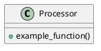

🖥️ **Python GUI Application Package Creation Template (AI-Ready, Modular, Industry-Standard, Step-by-Step)**

---

## How to use this template

- For each section, review the example and the expected format.
- Provide your input in the space indicated.
- Type **"continue"** to move to the next section after entering your input.
- The template adapts based on your choices (e.g., GUI type, test framework).
- At each step, your feedback is requested before finalizing.
- Replace placeholders like `<module>` or `your_gui_app` with your actual names.

---

# 1️⃣ Project Overview

**Describe your application in 1-2 sentences.**  
*Example:*  
> "A desktop and web GUI for image annotation with automated testing and CI/CD integration."

**Your turn (example answer below):**  
> "A Python GUI app for batch image resizing, supporting both desktop and web interfaces, with automated tests."

*Type your project overview, then say "continue" to proceed.*

---

# 2️⃣ Essential Project Details

**Fill in each point below. Example answers are provided.**

- **Main goal:** (e.g., "Desktop GUI for image annotation")
- **GUI type:** (Web [Gradio], Desktop [CustomTkinter], or both)
- **Execution environment:** (local, CI/CD, Docker, cloud)
- **Key dependencies:** (e.g., gradio, customtkinter, pytest)
- **Testing needs:** (unit, integration, E2E)
- **Code style/linting:** (e.g., black, ruff, mypy)
- **Documentation:** (e.g., mkdocs, pdoc)
- **CI/CD integration:** (e.g., GitHub Actions)
- **License & author:** (e.g., MIT, Author: Alex Smith)

**Your turn (example answer below):**  
> Main goal: Batch image resizing GUI  
> GUI type: Both (Gradio, CustomTkinter)  
> Environment: local, CI/CD  
> Dependencies: gradio, customtkinter, pytest  
> Testing: unit, integration  
> Linting: black, ruff, mypy  
> Docs: mkdocs  
> CI/CD: GitHub Actions  
> License: MIT, Author: Jane Doe

*Fill in your project details above, then say "continue" to proceed.*

---

# 3️⃣ Project Structure Preview

**Based on your inputs, here is a suggested project structure:**
```
your_gui_app/
├── src/
│   └── your_gui_app/
│       ├── __init__.py
│       ├── main.py
│       ├── core/
│       │   ├── processor.py
│       │   └── utils.py
│       ├── gui/
│       │   ├── web_interface.py       # Gradio
│       │   └── desktop_interface.py   # CustomTkinter
│       └── config/
│           └── settings.py
├── tests/
│   └── test_processor.py
├── docs/
│   ├── design.puml
│   └── index.md
├── pyproject.toml
├── README.md
├── LICENSE
├── .gitignore
├── .pre-commit-config.yaml
└── .editorconfig
```
**Please review this structure. Suggest any changes (e.g., add/remove folders, rename files, or include additional modules).**  
*Type your feedback, then say "continue" to proceed.*

---

# 4️⃣ Recommended Setup

**Review and confirm or modify the recommended setup. Example:**

- **Package Manager:** uv
- **Python Version:** 3.12
- **Standards:** PEP 8, PEP 621, PEP 517
- **Type Hints & Docstrings:** Yes
- **Testing:** pytest, 100% coverage (enforced in CI)
- **Pre-commit Hooks:** Yes (lint, format, test)
- **Modular Design:** Yes
- **Code Style:** black, ruff, mypy, .editorconfig
- **CI/CD:** GitHub Actions (build, test, lint, doc, coverage badge)
- **PlantUML:** For architecture and code flow diagrams

**Your turn:**  
*Confirm or edit your setup, then say "continue" to proceed.*

---

# 5️⃣ Build & Dependency Configuration

**Example: pyproject.toml (root)**
```toml
[project]
name = "your-gui-app"
version = "0.1.0"
description = "A Python GUI application package"
authors = [{ name = "Your Name", email = "you@example.com" }]
license = "MIT"
readme = "README.md"
requires-python = ">=3.10"

dependencies = [
    "pytest",
    "gradio",
    "customtkinter",
    "typing-extensions"
]

[project.optional-dependencies]
dev = [
    "black",
    "ruff",
    "mypy",
    "pytest-cov",
    "pre-commit"
]

[tool.black]
line-length = 88
target-version = ["py310"]

[tool.ruff]
line-length = 88
select = ["E", "F", "I"]
ignore = ["E501"]

[tool.mypy]
strict = true
```
*If you use a different build system or package manager, adapt this section accordingly.*

**Your turn:**  
*Confirm or adapt the build/dependency configuration for your needs, then say "continue" to proceed.*

---

# 6️⃣ Coding Standards & Linting

**Example: .editorconfig**
```
root = true

[*]
indent_style = space
indent_size = 4
end_of_line = lf
charset = utf-8
trim_trailing_whitespace = true
insert_final_newline = true
```
**Pre-commit hooks:**  
- Use [pre-commit](https://pre-commit.com/) with a `.pre-commit-config.yaml` for linting, formatting, and running tests before commit.

**Your turn:**  
*Confirm or provide your preferred code style, linting rules, and pre-commit setup, then say "continue" to proceed.*

---

# 7️⃣ Unit Testing Setup

**Example: pytest Integration**
- Add tests in the `tests/` directory, e.g., `tests/test_processor.py`
```python
import pytest
from your_gui_app.core import processor

def test_example():
    assert processor.example_function() == "expected_value"
```
- **Test coverage:** Use `pytest-cov` or `coverage.py` for coverage.  
- **CI enforcement:** Fail CI if coverage drops below threshold.

**Your turn:**  
*Confirm or specify your testing framework, example test, and coverage requirements, then say "continue" to proceed.*

---

# 8️⃣ Documentation & Diagrams

**Example: MkDocs + PlantUML**
- MkDocs or pdoc for documentation.
- Example PlantUML diagram (`docs/design.puml`):

- Reference diagrams in Markdown docs (e.g., `docs/index.md`).
- **Tip:** Add at least one PlantUML diagram for architecture, interfaces, or code flow.
- **MkDocs config:**  
  - Enable Markdown and diagram plugins as needed.
  - PlantUML integration: use mkdocs plugins or embed images.

**Your turn:**  
*Confirm or specify your documentation and diagramming preferences, then say "continue" to proceed.*

---

# 9️⃣ CI/CD Workflow

**Example: GitHub Actions**
```yaml
name: GUI Application CI
on: [push, pull_request]
jobs:
  build-test:
    runs-on: ubuntu-latest
    steps:
      - uses: actions/checkout@v3
      - name: Set up Python
        uses: actions/setup-python@v4
        with:
          python-version: '3.12'
      - name: Install uv
        run: |
          curl -LsSf https://astral.sh/uv/install.sh | sh
      - name: Install dependencies
        run: uv pip install -r requirements.txt
      - name: Run tests
        run: pytest --cov=src
      - name: Check formatting
        run: black --check src tests
      - name: Lint code
        run: ruff check src tests
      - name: Type check
        run: mypy src
```
- **Tip:** Add a badge for build and coverage status in `README.md`.
- **Artifacts:** Optionally upload test reports, coverage, and docs.

**Your turn:**  
*Confirm or adapt the CI/CD workflow for your needs, then say "continue" to proceed.*

---

# 🔟 Final Checklist

- [ ] Project overview and details filled
- [ ] Setup confirmed
- [ ] Structure reviewed and finalized
- [ ] Build & dependency configuration set
- [ ] Coding standards, .editorconfig, and pre-commit hooks set
- [ ] Unit tests and coverage ready
- [ ] Documentation and PlantUML diagrams in place
- [ ] CI/CD workflow ready
- [ ] Code is modular and reusable
- [ ] Contribution guidelines and code of conduct in place
- [ ] License compatibility reviewed

**Please review the checklist and type "done" when finished.**

---

## ✅ Next Steps

- Review all generated files and configurations.
- Run initial build and tests.
- Update documentation and diagrams as your project evolves.
- Use this template for future Python GUI projects to ensure consistency and quality.
